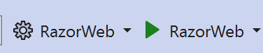

# Editorial Workflows & Content Approvals — EVOLVING PIRANHA CMS FOR “CONTENTS’R’US”

This project is the implementation of **Scenario 2: Editorial Workflows & Content Approvals** in PirinhaCMS. The main objective was to evolve PiranhaCMS to support **multi-steps editorial workflows**, role-based approvals, action auditing, and full observability.

## Main Project 

> The project was implemented bases on the official repository of Piranha CMS:
> [https://github.com/PiranhaCMS/](https://github.com/PiranhaCMS/)

---

## How to run it?

1. **Clone the repository:**

```bash
git clone https://github.com/RobertoCastro391/AS_Project_2Scenario_Piranha.git
cd AS_Project_2Scenario_Piranha/core/example/razorweb
```

2. **Dependency restore:**

```bash
dotnet restore
```

3. **Execute the app:**

```bash
dotnet run
```

> **Note:** If the terminal asks for the .net framework specification (e.g. `net8.0`), use:
> ```bash
> dotnet run --framework net8.0
> ```

4. **CMS Interface:**

```bash
https://localhost:5001/manager
```

> **Note:** It is also possible to run the app via the __Visual Studio__ app, by pressing the green run button in the middle menu. **Make sure the startup project is `../examples/RazorWeb/`**.



---

### Observability (via Docker)

In this project, observability was also implemented. To view the *Grafana* dashboard or *Jaeger* traces and visualize the metrics, you need to have *Docker* installed. To run the command below, make sure it is in the root of the folders.

```bash
docker compose up -d
```

Go to:

- [Grafana](http://localhost:3000) (`admin` / `admin`)
- [Jaeger UI](http://localhost:16686)

---

## Work done by:

- Roberto Castro - 107133
- Tiago Gomes - 108307
- Sara Almeida - 108796
- Duarte Santos - 124376